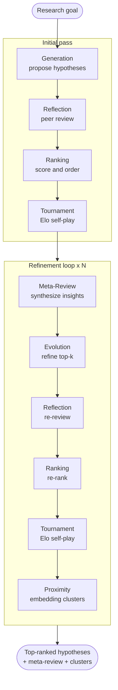

# coscientist-mlx


A native **Swift + MLX** port of [AI-CoScientist](https://github.com/The-Swarm-Corporation/AI-CoScientist):
a multi-agent pipeline that generates, peer-reviews, ranks (via Elo tournaments), and
iteratively evolves scientific research hypotheses — running **local open models on Apple
Silicon**, fully offline (with an optional hybrid remote judge).

[](https://github.com/iksnae/coscientist-mlx/actions/workflows/ci.yml)
[](https://iksnae.github.io/coscientist-mlx/documentation/aicoscientistkit/)
[](LICENSE)

## Background

The methodology comes from Google's **[*Towards an AI co-scientist*](https://arxiv.org/abs/2502.18864)**
(Gottweis et al., 2025): a multi-agent system that uses a *generate, debate, and evolve*
loop — specialized agents coordinated over an Elo-tournament self-play ranking — to
propose novel, testable research hypotheses for a stated goal. This project ports the
[Python `AI-CoScientist`](https://github.com/The-Swarm-Corporation/AI-CoScientist)
reimplementation of that methodology to a native Swift stack running on
[MLX](https://github.com/ml-explore/mlx-swift).

*Not to be confused with Sakana AI's [*The AI Scientist*](https://arxiv.org/abs/2408.06292)
— a separate, end-to-end paper-writing system. This is Google's hypothesis-generation
*co-scientist*.*

> Status: **hybrid routing.** M0–M5 (foundation → MLX inference → schema decoding → seven
> agents → engine → embedding proximity), feature-parity outputs, and **per-stage routing**:
> a `DecoderRouting` layer lets each agent use a different backend — on-device `MLX` and/or a
> hosted `RemoteLanguageModel` (OpenAI-compatible). Run on-device with `aicoscientist
> "<goal>" --run`, or hybrid (local generation + a strong remote judge) with
> `--remote-judge <model>` (uses `OPENAI_API_KEY`). Verified on macOS and on iPhone. See
> [`docs/ARCHITECTURE.md`](docs/ARCHITECTURE.md) for the full design and milestones,
> [`docs/MODELS.md`](docs/MODELS.md) for the open-model survey and tiered recommendations,
> and [`docs/IOS.md`](docs/IOS.md) for on-device iPhone/iPad enablement.

## Run the full workflow

```bash
# Fully on-device (downloads ~4.5 GB on first run):
swift run aicoscientist "Improve lithium-ion energy density" --run

# Persist the run, tune the loop:
swift run aicoscientist "Improve lithium-ion energy density" --run --save results.json \
  --iterations 2 --count 6

# Hybrid: keep generation/evolution on-device, route reflection + tournament to a
# strong remote judge (uses OPENAI_API_KEY):
swift run aicoscientist "Improve lithium-ion energy density" --run --remote-judge gpt-4o
```

## The pipeline

Seven single-responsibility agents run in a *generate → debate → evolve* loop, with an
Elo tournament for self-play ranking and embedding-based clustering for diversity:



Each agent's role is documented in the
[DocC site](https://iksnae.github.io/coscientist-mlx/documentation/aicoscientistkit/thesevenagents)
and in [`docs/ARCHITECTURE.md`](docs/ARCHITECTURE.md). Per-stage backend routing (local vs
remote) is the `DecoderRouting` layer — see
[`AICoScientistRemote`](https://iksnae.github.io/coscientist-mlx/documentation/aicoscientistremote/).

## Why a port

The Python original calls hosted LLM APIs and assumes the model returns valid JSON. This
port targets Apple Silicon with [MLX](https://github.com/ml-explore/mlx-swift): local,
private, zero marginal cost — and aims to be *superior* via embedding-based proximity
clustering, schema-constrained decoding, and batched inference. See the architecture doc.

## Requirements

- macOS 14+ on Apple Silicon
- Swift 6 toolchain (Xcode 26+)

## Build & test

```bash
swift build
swift test
```

## Documentation

- **API reference (DocC):** <https://iksnae.github.io/coscientist-mlx/documentation/aicoscientistkit/>
  — generated from source and deployed to GitHub Pages on every push to `main`
  (also covers [`AICoScientistMLX`](https://iksnae.github.io/coscientist-mlx/documentation/aicoscientistmlx/)
  and [`AICoScientistRemote`](https://iksnae.github.io/coscientist-mlx/documentation/aicoscientistremote/)).
- **Design & milestones:** [`docs/ARCHITECTURE.md`](docs/ARCHITECTURE.md)
- **Open-model survey:** [`docs/MODELS.md`](docs/MODELS.md)
- **iOS / iPadOS enablement:** [`docs/IOS.md`](docs/IOS.md)
- **Explainer video spec** (Remotion BEATS blueprint, not yet rendered):
  [`docs/video/pipeline-explainer.spec.md`](docs/video/pipeline-explainer.spec.md)

Build the docs locally:

```bash
swift package --disable-sandbox preview-documentation --target AICoScientistKit
```

## Engineering standards

This is a public project built to the team's cardinal values: **Clean Code, Clean
Architecture, SOLID, and genuine TDD/BDD.** Concretely:

- The domain/engine depends only on protocols (`LanguageModel`, `StructuredDecoder`,
  `EmbeddingModel`); every `import MLX*` is quarantined in the adapter layer.
- Behaviour is driven by tests written first; unit tests use a mock backend (no GPU, no
  downloads). Real-model runs live in a separate, opt-in integration target.
- MLX-Swift specifics are captured, source-verified, in
  [`.claude/skills/mlx-swift`](.claude/skills/mlx-swift/SKILL.md).

## Layout

```text
Sources/AICoScientistKit/     Core, Inference, Embeddings, Agents, Engine, Support (no MLX)
Sources/AICoScientistMLX/     on-device MLX adapter — the only place `import MLX*` appears
Sources/AICoScientistRemote/  hosted OpenAI-compatible LanguageModel adapter (Foundation only)
Sources/AICoScientistCLI/     aicoscientist driver; routes per stage across local + remote
Tests/                        test-first specs
docs/                         ARCHITECTURE.md, MODELS.md, IOS.md
```

## References

- Gottweis, J., Weng, W.-H., Daryin, A., et al. (2025). *Towards an AI co-scientist.*
  arXiv:2502.18864. <https://arxiv.org/abs/2502.18864>
  ([official PDF](https://storage.googleapis.com/coscientist_paper/ai_coscientist.pdf))
- The Swarm Corporation. *AI-CoScientist* (Python implementation, MIT).
  <https://github.com/The-Swarm-Corporation/AI-CoScientist>
- kyegomez. *Swarms — Multi-Agent Orchestration Framework* (Apache-2.0).
  <https://github.com/kyegomez/swarms>
- Lu, C., et al. (2024). *The AI Scientist.* arXiv:2408.06292 — *distinct* from Google's
  co-scientist. <https://arxiv.org/abs/2408.06292>

## Citation

If you use this work, please cite the originating paper:

```bibtex
@article{gottweis2025coscientist,
  title   = {Towards an AI co-scientist},
  author  = {Gottweis, Juraj and Weng, Wei-Hung and Daryin, Alexander and Tu, Tao and others},
  year    = {2025},
  journal = {arXiv preprint arXiv:2502.18864},
  url     = {https://arxiv.org/abs/2502.18864}
}
```

## Acknowledgements

This project re-implements, on Apple Silicon, the methodology of Google's
*Towards an AI co-scientist* and follows the structure of the Swarm Corporation's
Python `AI-CoScientist` (MIT), which builds on the [Swarms](https://github.com/kyegomez/swarms)
framework (Apache-2.0). See [`NOTICE`](NOTICE) for full attribution.

## License

[MIT](LICENSE) © 2026 K Mills.
