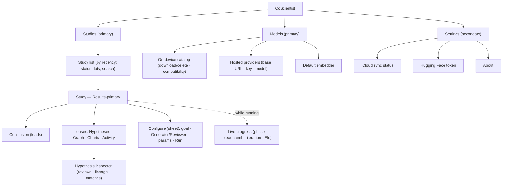

# CoScientist — Information Architecture

Date: 2026-06-05. Status: Draft (feeds wireframing → native design).

The IA for the CoScientist apps (SwiftUI; iPhone, iPad, macOS), designed
around **actual data + real usage**. Organizing principle: **the Study's
data and outcome lead; run configuration recedes.** Built with the four IA
systems — Organization, Labeling, Navigation, Search.

Settled decisions (operator, 2026-06-05):
- **Study detail is Results-primary**; configuration + Run live behind a
  **Configure** sheet/inspector, so the main surface is always the Study data.
- **Models is a top-level destination** (on-device catalog + hosted
  providers + offline management), not buried in Settings.
- **iPhone** uses a single Studies navigation stack; **Models/Settings** are
  reached via toolbar buttons → sheets.

---

## 1. Content inventory (grounded in the data model)

| Content type | Key attributes (real fields) | Relationships |
| --- | --- | --- |
| **Study** | title, goal, status (draft/running/done/error), generator + reviewer (`ModelChoice`: on-device \| hosted), hypothesesPerGeneration, iterations, evolutionTopK (survivors), tournamentRounds, createdAt/updatedAt | has one latest **Result** (`RunSnapshot?`); synced via CloudKit |
| **Result** (RunSnapshot) | conclusion (top hypothesis + top Elo + synthesis), metaReviewSummary, metrics, errors | has many **Hypotheses**, **Clusters**, **Activity** events |
| **Conclusion** (RunConclusion) | topHypothesis, topElo, synthesis | projection of the Result |
| **Hypothesis** | text, eloRating, score, winCount/lossCount/winRate, clusterID | has many **Reviews**; has **lineage**; belongs to a **Cluster** |
| **Review** (HypothesisReview) | 6 scores (scientific soundness, novelty, relevance, testability, clarity, impact), reviewSummary, safetyEthicalConcerns | belongs to a Hypothesis |
| **Cluster** (SimilarityCluster) | id/label, members | groups Hypotheses (proximity) |
| **Activity event** | phase, iteration, completed/total, detail, topElo | the live + recorded pipeline log |
| **Live run** (RunState) | phase (7 stages), iteration/maxIterations, completed/total, downloadProgress, Elo timeline | transient view of a running Study |
| **Model** (CatalogModel) | key, displayName, repoID, tier, strengths, approxSizeGB, minRAMGB, downloaded?, fit(deviceRAM) | on-device generator/embedder |
| **Provider** | base URL, API key, model, fetched model list | source of hosted `ModelChoice`s |

---

## 2. Organization systems (LATCH)

| Surface | Primary scheme | Facets / secondary |
| --- | --- | --- |
| **Studies list** | **Time** (recent activity) | status (draft/running/done/error); later: search by title/goal |
| **Hypotheses** | **Hierarchy** (Elo rank, best first) | **Category** = cluster; attributes = score, win-rate |
| **Pipeline / Activity** | **Time** (the 7-stage sequence × iteration) | phase kind (icons) |
| **Models** | **Category** (Generators / Embedders / Providers) | facets: downloaded, device-compatible (RAM fit) |
| **Reviews** | **Category** (the 6 score dimensions) | — |

7±2 rule: results are presented as **one ranked list with switchable lenses**
(not many parallel categories). Hierarchies stay ≤ 3 levels.

---

## 3. Labeling system (controlled vocabulary)

User-facing terms (align with `writing-for-interfaces`; avoid internal jargon):

| Preferred term | Means | Avoid |
| --- | --- | --- |
| **Study** | one research investigation + its config + latest result | "run record", "session" |
| **Goal** | the research question the agents explore | "prompt", "query" |
| **Generator** / **Reviewer** | the model roles (generate/evolve vs judge) | "backend", "LLM A/B" |
| **Run** | execute the study | "start workflow" |
| **Conclusion** | the synthesized answer (meta-review + top hypothesis) | "meta-review summary" |
| **Hypotheses** | the ranked candidate answers | "outputs", "results rows" |
| **Elo** | tournament ranking score (label it "rank score" on first use) | unexplained "Elo" |
| **Survivors per round** | evolutionTopK | "top-K", "evolutionTopK" |
| **Tournament rounds** | matches per hypothesis | "rounds" alone |
| **Activity** | the live/recorded pipeline log | "events", "transcript" |
| **Clusters** | groups of similar hypotheses | "proximity classes" |
| **Models** | on-device + hosted models you can use/manage | "catalog", "weights" |

---

## 4. Navigation model

Two **primary** destinations (**Studies**, **Models**) + **Settings**
(secondary). Adapts by platform; one mental model.



### Per-platform shells

- **macOS:** `NavigationSplitView` — sidebar switches **Studies / Models**;
  Studies column = list, detail = Study (Results-primary). **Settings** in
  the standard ⌘, window. Hypothesis **inspector** = trailing pane.
- **iPad:** `NavigationSplitView` (size-class adaptive) — sidebar
  destinations (Studies/Models) → list → detail; inspector as a trailing
  pane on regular width. Settings via a toolbar button → sheet.
- **iPhone:** single **Studies** stack (list → Study → inspector as a
  sheet). **Models** and **Settings** via toolbar buttons → sheets. Configure
  is a sheet on all platforms.

### Study detail — section hierarchy (outcome-first)

1. **Header** — Study title (inline-editable), status, a one-line config
   summary chip, **Run/Stop**, **Configure** (opens sheet), Export.
2. **Live** (when running) — multi-indicator progress (phase breadcrumb,
   iteration, current-phase gauge, pool, Elo sparkline).
3. **Conclusion** (when done) — synthesis (leads) + top hypothesis
   (truncated, expandable) + top Elo. Errors banner if issues.
4. **Hypotheses** (default lens) — ranked list (Elo, score, win%, cluster).
5. **Lenses** — Graph (clusters/links), Charts (Elo over time, score
   dimensions), Activity (pipeline log). Same data, different views.
6. **Inspector** — selected hypothesis: the 6 review scores, review summary,
   safety/ethical notes, lineage, match record.

---

## 5. Content model (fields & relationships)

```yaml
Study:
  fields: [title, goal, status, generator, reviewer, hypothesesPerGeneration,
           iterations, evolutionTopK, tournamentRounds, createdAt, updatedAt]
  has_one: { result: RunSnapshot? }
RunSnapshot:
  fields: [conclusion, metaReviewSummary, metrics, errors]
  has_many: [hypotheses: Hypothesis, clusters: SimilarityCluster, activity: ActivityEvent]
Hypothesis:
  fields: [text, eloRating, score, winCount, lossCount, winRate, clusterID]
  has_many: { reviews: HypothesisReview }
  has: { lineage: [String] }
Model:        { fields: [key, displayName, repoID, tier, strengths, approxSizeGB, minRAMGB, downloaded] }
Provider:     { fields: [baseURL, apiKey, model, fetchedModels] }
```

---

## 6. Validation plan (tree test — pre-build)

Findability tasks to run against the sitemap (success rate + directness):

1. Find the **review scores** for the top hypothesis.
2. **Change the Reviewer** model for a study.
3. **Download a model** for offline use.
4. Find **why a run produced no hypotheses** (errors).
5. See **which phase** a running study is in.
6. **Rename** a study; find a study by its goal.
7. Add a **hosted provider** and pick a hosted model.

Refine the hierarchy where directness < 70%.

---

## 7. Accessibility (WCAG 2.4 + Apple)

- Descriptive nav titles (the **Study title** is the detail's title).
- Logical focus order: Header → Conclusion → Hypotheses → Inspector.
- Multiple paths: sidebar destinations + search; inspector reachable from
  list and graph.
- Dynamic Type throughout; VoiceOver labels for Elo/score/charts (e.g.
  "Top hypothesis, rank score 1277, 100 percent win rate").
- Don't encode meaning in color alone (status dots also carry text/icon).

---

## 8. What changes vs today

- Study detail flips from **config-first** to **Results-first**; Configure
  moves into a **sheet** (kills the "config dominates the screen" problem).
- **Models** is promoted from a Settings tab to a **top-level destination**
  (on-device + providers + embedder unified — one place for the "what models
  do I have / use" mental model).
- The 4 result tabs are reframed as **lenses on one ranked result**, led by
  the **Conclusion**.

Next: `wireframing` — lo-fi wireframes + user flows from this IA, then
`swift-design` to take them native.
