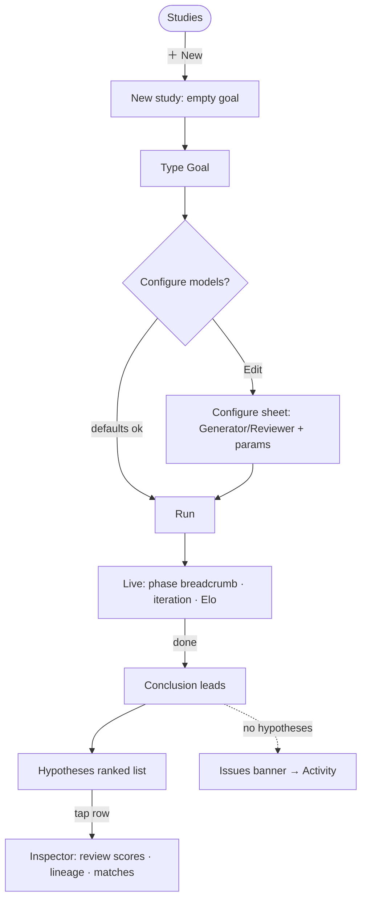
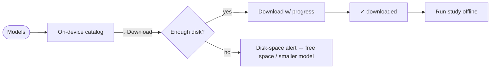
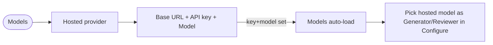

# CoScientist — Lo-Fi Wireframes & User Flows

Date: 2026-06-05. Status: Draft (lo-fi). Feeds rendered mockups (image-generate)
→ native build (swift-design).

Driven by `docs/DESIGN-IA.md`. Native Apple patterns only (NavigationSplitView,
sheets, inspectors, segmented controls, Form/List, toolbars). Lo-fi = structure +
hierarchy + IA vocabulary, not visual styling. Boxes are placeholders; `[ ]` =
control, `(•)` = selected, `▼` = menu, `›` = disclosure.

---

## 1. Shells (navigation) per platform

### macOS / iPad — NavigationSplitView (regular width)

```
+============================================================================+
| ◉ ◉ ◉   CoScientist                                          [＋] [⤴] [⚙]  |
+===========+==========================+=================================+====+
| SIDEBAR   | STUDIES (list)           | STUDY  (detail — Results-first) | INS|
|           |                          |                                 | PEC|
| ▸ Studies | [search…]                |  Title ………………        [Run] [⋯] | TOR|
| ▸ Models  | ● Coffee benefits   2m   |  status · models · 8 hyp ·[Edit]|    |
|           | ● Red light therapy 9m   | ------------------------------- |(when
|           | ○ Graves disease    1h   |  ✓ CONCLUSION        top Elo … | a hyp
|           |                          |  synthesis text leads…          | is
|           |                          |  TOP HYPOTHESIS  (truncated) ›  | selec
|           |                          | ------------------------------- | ted) |
|           |                          | [Hypotheses][Graph][Charts][Act]|    |
|           |                          |  🏆1277 0.83 66% [cluster-1]    |    |
|           |                          |  hypothesis text…               |    |
|           |                          |  🏆1221 0.79 …                  |    |
+===========+==========================+=================================+====+
```
- Sidebar = the two **primary destinations** (Studies, Models). Toolbar: `＋`
  New, `⤴` Export, `⚙` Settings (opens ⌘, window on macOS / sheet on iPad).
- Inspector is a **trailing pane** (regular width); appears when a hypothesis
  is selected. iPad collapses it to a **sheet** at compact width.

### iPhone — single Studies stack (compact)

```
+---------------------+      +---------------------+      +---------------------+
| Studies     [＋][⚙] |      | ‹ Studies      [⋯]  |      | ‹  Hypothesis  [Done]|
| [search…]           |      |  Coffee benefits    |      |  🏆 1277  score .83 |
| ● Coffee benefits 2m| tap  |  status·8 hyp·[Edit]|tap   |  100% win · cluster1|
| ● Red light    9m   | ───► | -------------------  |hyp──►| ------------------- |
| ○ Graves       1h   |      |  ✓ CONCLUSION        |      |  Scientific  ▓▓▓▓░  |
|                     |      |  synthesis leads…    |      |  Novelty     ▓▓▓░░  |
|                     |      |  [Hyp][Graph][Ch][Ac]|      |  Relevance   ▓▓▓▓▓  |
|                     |      |  🏆1277 …            |      |  Review summary…    |
+---------------------+      +---------------------+      +---------------------+
```
- No tab bar. **Models** and **Settings** open as sheets from toolbar buttons.
- Inspector = full sheet. Configure = sheet.

---

## 2. Study — Results-primary (done state)

```
+----------------------------------------------------------------------+
| Coffee Consumption Benefits                          [ Run ]  [ ⋯ ]  |  ← title (inline edit), Run, ⋯=Export/Delete
| Done · 3 hypotheses · 1 repair        Qwen3-4B · 8 hyp · 8 it [Edit] |  ← status line + config summary chip → [Edit] opens Configure sheet
+----------------------------------------------------------------------+
| ✓ CONCLUSION                                            top Elo 1,277 |
|  Unfiltered and filtered coffee exhibit distinct metabolic and        |  ← synthesis LEADS (meta-review)
|  neuroprotective effects mediated through gut-microbiome modulation…   |
|                                                                       |
|  TOP HYPOTHESIS                                                        |  ← truncated, expandable (not duplicated below)
|  Chronic consumption of filtered coffee… [Show more]                  |
+----------------------------------------------------------------------+
| ( Hypotheses )  Graph   Charts   Activity                            |  ← lens switch (segmented). Same result, different views.
+----------------------------------------------------------------------+
|  🏆 1,277   score 0.83   66% win   [cluster-1]                    ›  |  ← ranked list; tap row → Inspector
|  Chronic consumption of filtered coffee, particularly varieties…      |
|  ------------------------------------------------------------------   |
|  🏆 1,221   score 0.79   37% win   [cluster-2]                    ›  |
|  Unfiltered and filtered coffee exhibit distinct metabolic…           |
+----------------------------------------------------------------------+
```
Annotations:
1. Header is compact: title + one status line + **config summary chip**. No
   pickers/steppers here — they live in **Configure** (sheet).
2. Conclusion **synthesis** is the headline; the top hypothesis is a labeled,
   truncated lead with *Show more* — never the full duplicate of row 1.
3. Lenses: **Hypotheses** (default), **Graph** (clusters/links), **Charts**
   (Elo over time, score dimensions), **Activity** (recorded pipeline log).
4. Empty/error: if a finished run produced no hypotheses → an **Issues** banner
   replaces the Conclusion ("No hypotheses produced · N issues — see Activity").

---

## 3. Study — Live run state (while running)

```
+----------------------------------------------------------------------+
| Coffee Consumption Benefits                         [ Stop ]  [ ⋯ ]  |
| Running…                               Qwen3-4B · 8 hyp · 8 it       |  ← config summary read-only while running
+----------------------------------------------------------------------+
|  Gen ▸ Refl ▸ Rank ▸ [TOURN] ▸ Meta ▸ Evo ▸ Prox     stage 4 of 7   |  ← 7-stage breadcrumb (current lit)
|                                                                       |
|   ( ◔ )   Refinement 2 of 8     🧪 8 hypotheses        ╱╲╱‾  Elo ▲   |  ← radial gauge (completed/total) · iteration · pool · sparkline
|   12/30   ▓▓▓▓▓▓░░░░░░                                  top 1,277     |
|                                                                       |
|  reviewing 5 · match 12/30: A wins                                    |  ← live detail line
+----------------------------------------------------------------------+
|  Hypotheses   Graph   Charts   ( Activity )                          |  ← while live, defaults to Activity lens
|  ▸ tournament  iter2  12/30   top 1277                                |  ← live activity feed (auto-scroll)
|  ▸ reflection  iter2  reviewed 5/5                                    |
+----------------------------------------------------------------------+
```
- This is the existing multi-indicator `RunProgressView` as the live header.
- Download phase reuses this region: "Downloading model — 42%" / "Loading model".

---

## 4. Configure (sheet) — opened from [Edit]/[Configure]

```
            +--------------------------------------------------+
            |  Cancel            Configure              Run ►  |
            +--------------------------------------------------+
            |  NAME                                            |
            |  [ Coffee Consumption Benefits                ]  |  ← Study title; auto-tracks the Goal's first line until edited (StudyTitle, M22)
            |  GOAL                                            |
            |  [ Benefits of coffee consumption…            ]  |  ← multiline TextEditor
            |                                                  |
            |  MODELS                                          |
            |  Generator      Qwen3-4B Instruct (4-bit)    ▼   |  ← picker: on-device (✓downloaded, fits) / Hosted
            |   on-device · fits comfortably · downloaded      |  ← one concise caption (current choice)
            |  Reviewer       Qwen3-4B Instruct (4-bit)    ▼   |
            |   on-device · fits comfortably · downloaded      |
            |                                                  |
            |  RUN                                             |
            |  Hypotheses     [ − ]  8  [ ＋ ]                  |
            |  Iterations     [ − ]  8  [ ＋ ]                  |
            |  ▸ Advanced                                      |  ← disclosure (collapsed by default)
            |      Survivors per round       [ − ] 3 [ ＋ ]    |
            |      Tournament rounds / hyp   [ − ] 3 [ ＋ ]    |
            +--------------------------------------------------+
```
- **Name (title)** leads the sheet. It auto-tracks the Goal's first line until the
  user edits it (the `StudyTitle` rule), then stays independent. The same title is
  shown/edited inline in the Results header — both bind to `study.title`.
- Form/grouped sections. Picker rows show the **selected model + one caption**.
- "Run ►" dismisses the sheet and starts the run (study returns to live state).
- iPhone: full-height sheet; iPad/macOS: medium sheet or popover from [Edit].

---

## 5. Hypothesis Inspector (pane on regular, sheet on compact)

```
+----------------------------------+
|  Hypothesis              [Done]  |   ← title; Done only on compact (sheet)
+----------------------------------+
|  🏆 1,277   score 0.83           |
|  100% win (6/6) · [cluster-1]    |
|                                  |
|  Chronic consumption of filtered |   ← full hypothesis text (selectable)
|  coffee, particularly varieties… |
|                                  |
|  REVIEW SCORES                   |
|  Scientific soundness  ▓▓▓▓░ 4.2 |   ← 6 dimensions as bars
|  Novelty               ▓▓▓░░ 3.1 |
|  Relevance             ▓▓▓▓▓ 4.8 |
|  Testability           ▓▓▓▓░ 4.0 |
|  Clarity               ▓▓▓▓░ 4.3 |
|  Impact                ▓▓▓▓░ 4.1 |
|                                  |
|  Review summary…                 |
|  ⚠︎ Safety / ethical notes…      |   ← only if present
|                                  |
|  LINEAGE                         |   ← evolution history (if any)
|  v1 → refined (iter 2) → v3      |
+----------------------------------+
```

---

## 6. Models (top-level destination)

```
+----------------------------------------------------------------------+
| Models                                                               |
+----------------------------------------------------------------------+
| ON-DEVICE                                                            |
|  Qwen3-4B Instruct (4-bit)   small · ~2.3 GB     ✓ downloaded  [🗑]  |  ← downloaded → size + delete
|  Qwen3-8B Instruct (4-bit)   needs 16 GB · ~4.7 GB        [ ↓ ]      |  ← not downloaded → Download (disk guard) + progress
|  Qwen3-1.7B (4-bit)          tiny · ~1.1 GB               [ ↓ 42% ▓]|  ← downloading → progress
|  Download a model here to run offline. Hosted models run over network|
+----------------------------------------------------------------------+
| DEFAULT EMBEDDER                                                     |
|  Qwen3-Embedding 0.6B                                          ▼     |
+----------------------------------------------------------------------+
| HOSTED PROVIDER                                                      |
|  Base URL   [ https://api.openai.com/v1                          ]   |
|  API key    [ ••••••••••••                       ]    Get a key →   |  ← link opens platform.openai.com/api-keys
|  Model      [ gpt-4o                 ▼ ]              [ Refresh ]    |
|  Models appear automatically in study pickers (no refresh needed).  |
+----------------------------------------------------------------------+
| 6.2 GB used on disk                                                  |
+----------------------------------------------------------------------+
```
- Unifies the old Settings ▸ Models + Providers into one destination.
- Rows are compatibility-aware (RAM fit) and download/delete inline.

---

## 7. Settings (secondary — ⌘, window / sheet)

```
+----------------------------------+
|  Settings                        |
+----------------------------------+
|  iCloud Sync         On  ✓       |   ← status only; sync is automatic (M17)
|  Hugging Face token  [ •••• ]    |   ← for gated repos
|  About               CoScientist |   ← version, links, licenses
+----------------------------------+
```
- Slim: only true app-level prefs. Model/provider config lives in **Models**.

---

## 8. User flows (Mermaid)

### Primary: create → run → read → inspect



### Download a model for offline



### Add a hosted provider



---

## 9. Responsive summary

| Surface | iPhone (compact) | iPad / macOS (regular) |
| --- | --- | --- |
| Shell | Studies stack; Models/Settings = sheets | NavigationSplitView; sidebar destinations |
| Study detail | full-screen, scrolls | detail column |
| Inspector | sheet | trailing pane |
| Configure | full-height sheet | medium sheet / popover |
| Models | sheet from toolbar | sidebar destination |

---

## 10. Next

1. Render polished **mockups** (image-generate, brand palette) for the hero
   surfaces: **Study Results**, **Live run**, **Configure sheet**, **Models**.
2. Take the chosen direction **native** with `swift-design` (HIG, tokens),
   then `design-audit` to enforce. Build under a UI milestone (post-IA).
